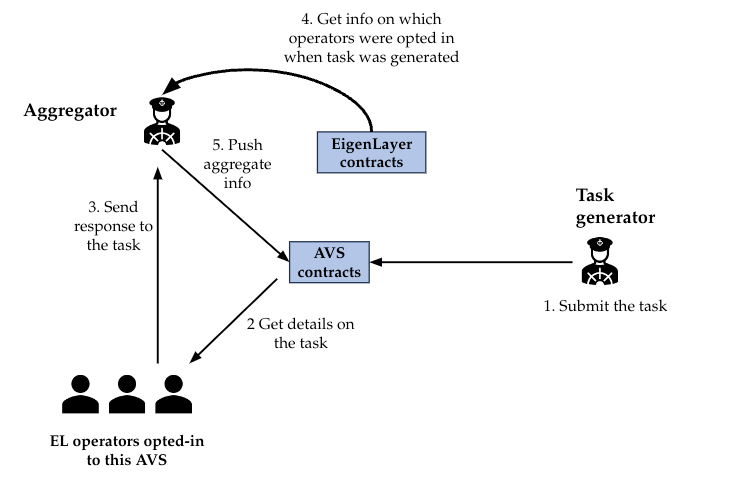

# Donation AVS

Welcome to the Donation AVS.

This project shows you how to use an AVS to validate portfolio value, before executing swaps.

There are 5 steps to this AVS:

- AVS consumer (Donation smart contract) requests donation campaign to be closed. This means swapping all ERC20 tokens for $USDC, and transfering the $USDC amount to the campaign recipient.
- AVS takes on the request by emitting an event for operators to pick up the request
- any operator who is staked to serve this AVS takes this request and determines the portfolio value. If the portfolio value is above the determined threshold, the swap is executed.
<!-- - the operator submits this message with their signature back to the AVS -->
- _if the operator is in fact registered to the AVS and has the minimum needed stake, the submission is accepted_

## Quick Start

### Dependencies

1. [npm](https://docs.npmjs.com/downloading-and-installing-node-js-and-npm)
2. [Foundry](https://getfoundry.sh/)
3. [Docker](https://www.docker.com/get-started/)

### Steps

0. run `npm install`
1. Make sure Docker is running
2. Run `make start-chain-with-contracts-deployed`

   2.1 This will build the contracts, start an Anvil chain, deploy the contracts to it, and leaves the chain running in the current terminal

3. Open new terminal tab and run `make start-operator`

   3.1 This will compile the AVS software and start monitering new tasks

4. Open new terminal tab and run `make spam-tasks` (Optional)

   4.1 This will spam the AVS with random names every 15 seconds

## Extensions

- Operator needs a minimum stake amount to make submissions
- Add another strategy to the AVS
- Operator must respond within a certain number of blocks
